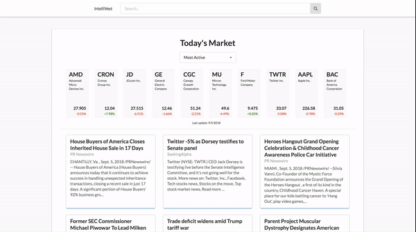
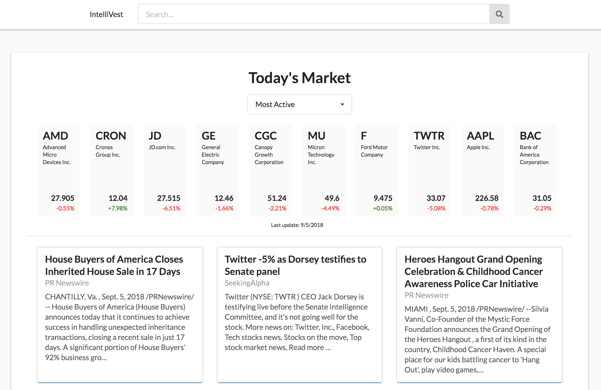
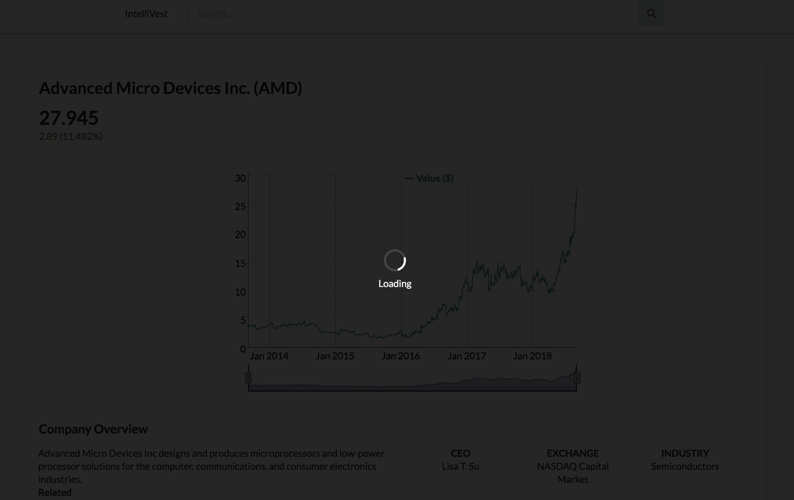
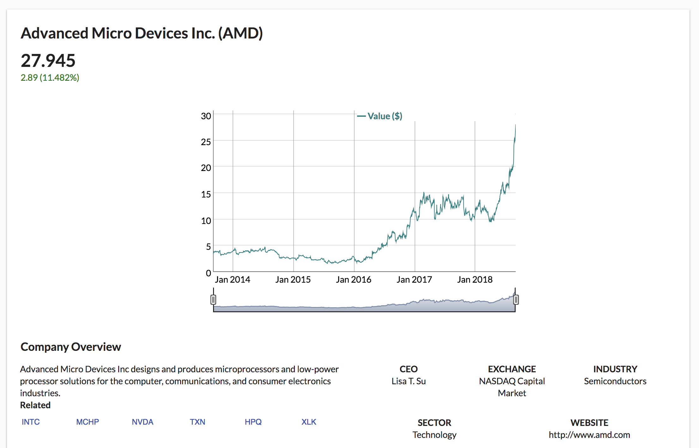
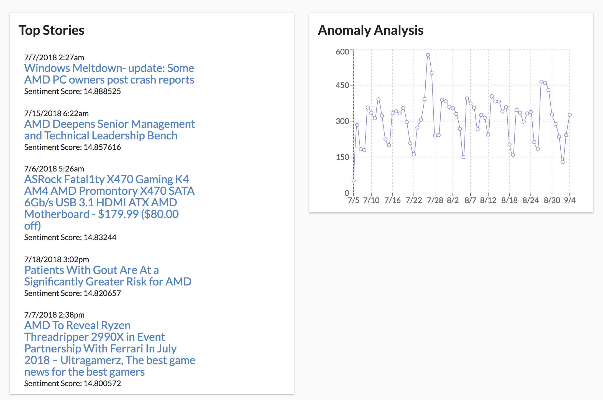
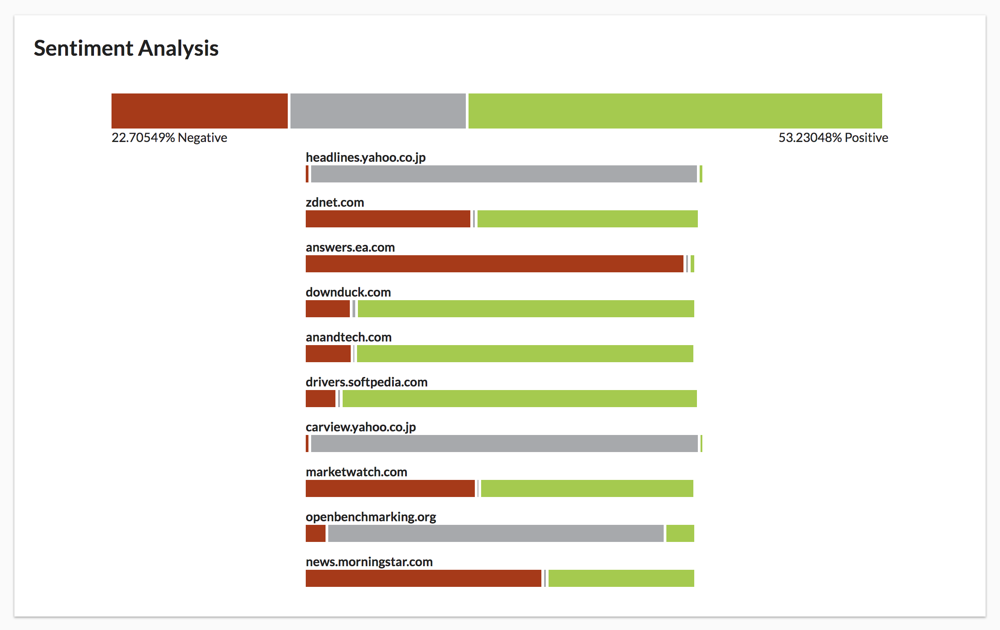

# IntelliVest

Sentiment analysis of stock market news and visualization of its impact on financial movement

## Table of Contents
1. [Features](#features)
1. [Sentiment](#sentiment)
1. [Built With](#builtwith)
1. [Screenshots](#screenshots)

## Features
- Informative landing page of the day's most active, top gainers, top losers stocks. These are clickable.
- Ability to search for a chosen stock (Ticker symbol only at the moment).
- Progress bar shown while rendering information of stock onto page.

## Sentiment
- Leveraged IBM Watson Discovery to identify sentiment in stock news.
- Anomalies detected in mentions of the searched stock are graphed.
- Overall sentiment and sentiment from specific sources are displayed.

## Built With
* [React](https://reactjs.org/)
* [Semantic UI](http://react.semantic-ui.com/)
* [Express](https://expressjs.com/)
* [Recharts](http://recharts.org/en-US/)
* [Watson Developer Cloud](https://github.com/watson-developer-cloud/node-sdk)

## Screenshots

